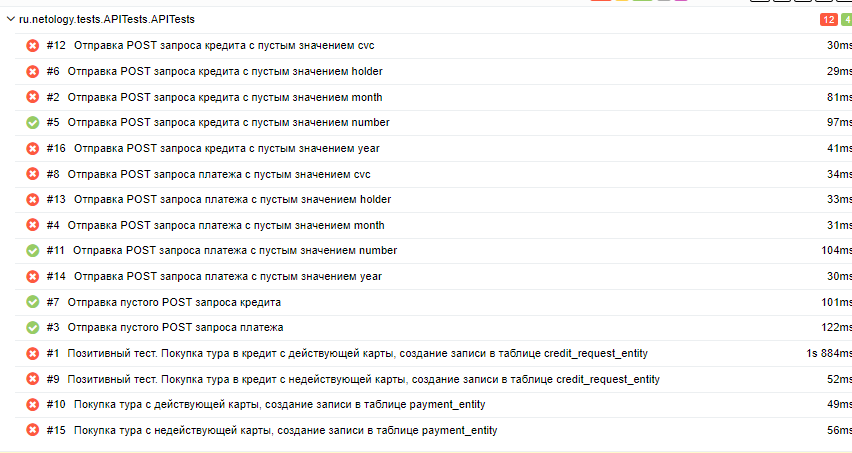

# Краткое описание
Проведено автоматизированное тестирования приложения, которое предлагает купить тур двумя способами:

1. Оплата по дебетовой карте.
2. Выдача кредита по данным банковской карты.

Приложение поддерживает две БД: 
* MySQL;
* PostgreSQL.

## Количество тест-кейсов 

Всего в тестировании проведено 51 теста:

* 22 пройдено успешно (43,13%)
* 29 не пройдено (56,87%)

По результатам тестирования были заведены [баг-репорты](https://github.com/PniVedro/diplomQA/issues)

## Общие рекомендации

1. Исправить выявленные баги в приложении.
2. Составить документацию по проекту с указанием ожидаемого поведения элементов.
3. Добавить атрибут "test-id" для элементов страниц.
